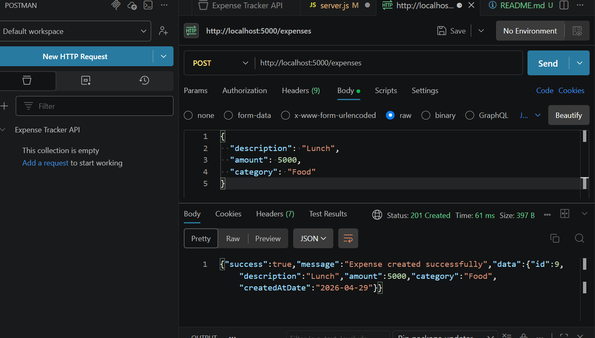
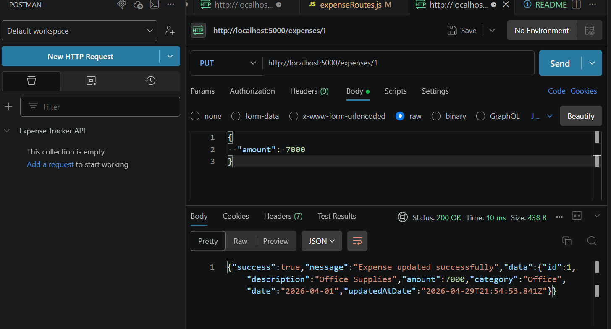
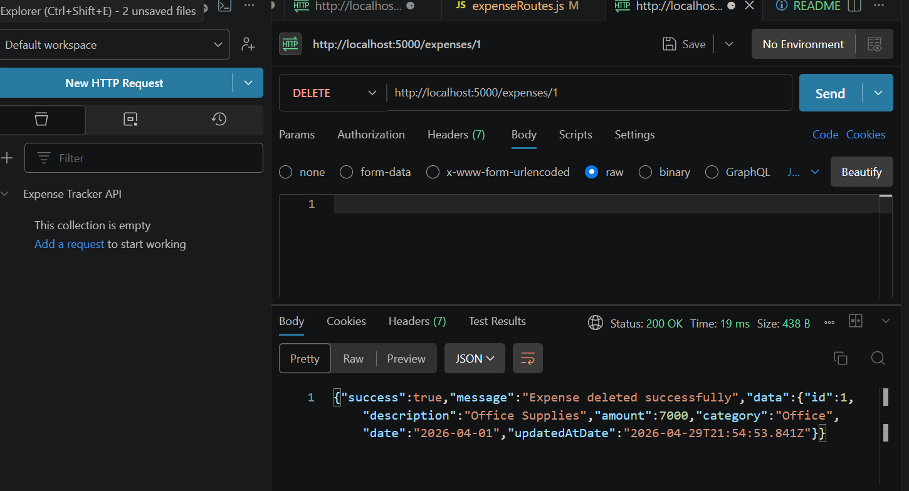
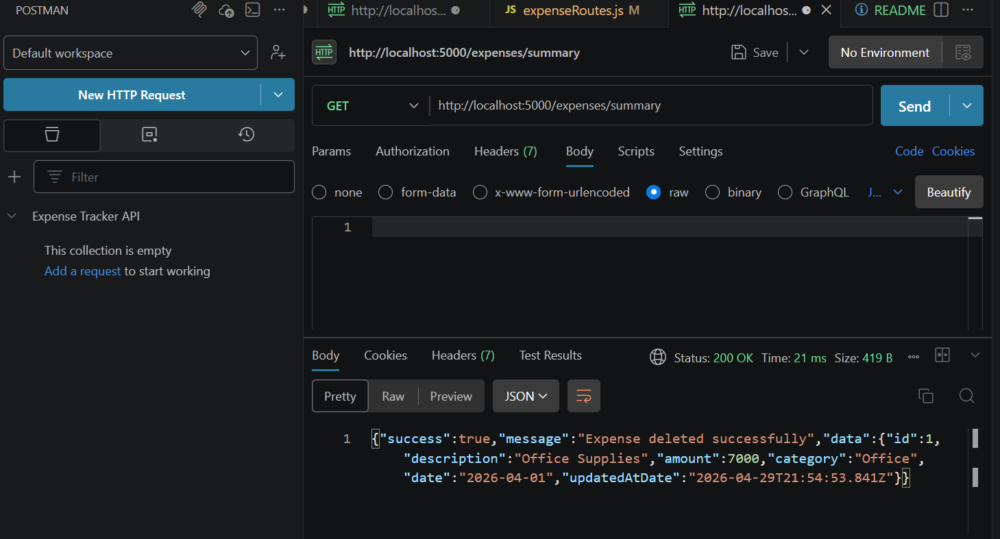

# Expense Tracker API

## 📌 Overview

The Expense Tracker API is a Node.js and Express.js backend application that allows users to manage their expenses efficiently. It supports full CRUD operations and provides a summary of all expenses.

---

## 🚀 Features

* Create new expenses
* Retrieve all expenses
* Update existing expenses
* Delete expenses
* View expense summary (total + category breakdown)
* Input validation for data integrity

---

## ⚙️ Tech Stack

* Node.js
* Express.js
* JSON (file-based storage)
* Postman (testing API)

---

## 📁 Project Structure

```text
group-3c-project/
│── api/
│   ├── controllers/
│   ├── routes/
│   ├── data/
│   └── server.js
│
│── screenshots/
│── package.json
│── README.md
```

---

## 📡 API Endpoints

### ➤ Create Expense

```http
POST /expenses
```

### ➤ Get All Expenses

```http
GET /expenses
```

### ➤ Update Expense

```http
PUT /expenses/:id
```

### ➤ Delete Expense

```http
DELETE /expenses/:id
```

### ➤ Expense Summary

```http
GET /expenses/summary
```

---

## 📸 Screenshots

### 🟢 Create Expense (POST)



### 🔵 Get Expenses (GET)


### 🟡 Update Expense (PUT)



### 🔴 Delete Expense (DELETE)



### 🟣 Expense Summary



---

## 🧪 Validation Rules

* Description must be a non-empty string
* Amount must be a positive number
* Category must be a non-empty string

---

## 👥 Team Roles

* Person 1 – Setup, Create & Read
* Person 2 – Update, Delete & Logic
* Person 3 – Testing, Documentation & Presentation

---

## 🎯 Future Improvements

* Add MongoDB database
* Add user authentication
* Build frontend UI
* Add budgeting features

---

## 📌 Notes

* Ensure server is running before testing
* Use Postman for API testing
* All endpoints are prefixed with `/expenses`
